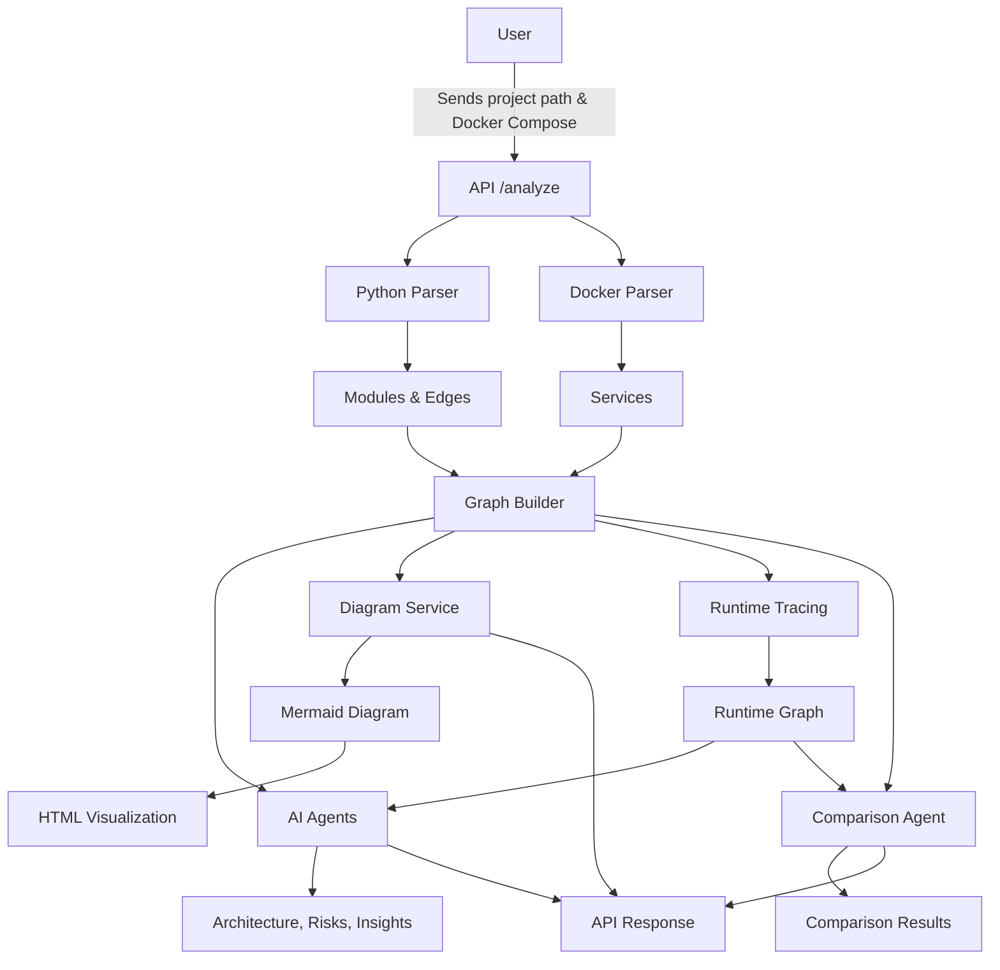

# Visualization Agent

**Latest Features:**
- Analyze any public GitHub Python repo by URL (no manual download needed)
- `docker-compose.yml` is now optional—analyze repos even if they don't have Docker Compose
- Improved error handling and Windows compatibility for repo deletion
- CORS is enabled by default for local frontend-backend development


## Project Overview
Visualization Agent is an AI-powered platform for analyzing and visualizing Python project architectures. It parses code and Docker Compose files, traces runtime execution, builds dependency graphs, and uses OpenAI GPT-4o-mini to generate architecture descriptions, risk analysis, and insights. It outputs Mermaid diagrams and HTML visualizations, all accessible through a modern React frontend.
---

## Project Structure

- `backend/` — FastAPI backend for code analysis, AI agents, and diagram generation
- `frontend/` — React + Vite frontend for user interaction and visualization
- `data/` — Sample projects and test data
---

## Quick Start

### 1. Backend Setup

```bash
cd backend
python -m venv venv
venv\Scripts\activate  # On Windows
pip install -r ../requirements.txt
uvicorn app.main:app --reload
```

### 2. Frontend Setup

```bash
cd frontend
npm install
npm run dev
```

The frontend will be available at [http://localhost:5173](http://localhost:5173) and expects the backend running at [http://localhost:8000](http://localhost:8000) by default.

---

## How to Use

1. Open the frontend in your browser.
2. Enter the GitHub repository URL of a Python project and click **Analyze**.
	- The backend will automatically clone the repo and analyze it (no need to download manually).
	- If the repo does not have a `docker-compose.yml`, analysis will still work (services will be empty).
3. View the generated architecture diagram, AI analysis, and risk list on the results page.

---

## Main Features
- **Static code analysis:** AST-based module and import extraction
- **Docker Compose parsing:** Service-to-code mapping
- **Runtime tracing:** Captures actual function calls and execution flow
- **AI-driven analysis:** Architecture description, risk detection, and insights
- **Diagram generation:** Mermaid and HTML
- **Graph comparison:** Static vs. runtime graphs

---

## Backend Modules & Responsibilities
---

## Frontend Overview

The frontend is built with React 19, Vite, and Tailwind CSS. It provides:

- **Project Submission:** Input form for GitHub repo URLs
- **Visualization:** Mermaid.js diagrams
- **AI Results:** Architecture summary, risks, and insights

See `frontend/README.md` for more details.

### Parsers (`backend/app/parsers/`)
- `python_parser.py`: Extracts Python modules and their import relationships using AST.
- `docker_parser.py`: Reads Docker Compose YAML files to find service definitions.
- `service_mapper.py`: Connects Docker services to Python modules by matching names.

### Agents (`backend/app/agents/`)
- `architecture_agent.py`: Uses AI to generate human-readable architecture descriptions.
- `risk_agent.py`: Finds risky areas (like bottlenecks or isolated code) in the architecture.
- `diagram_agent.py`: Improves Mermaid diagrams for clarity using AI.
- `comparison_agent.py`: Compares static (code) and runtime (actual execution) graphs to find differences.
- `insight_agent.py`: Provides deeper insights and suggestions for improvements.

### Graph (`backend/app/graph/`)
- `graph_builder.py`: Builds directed graphs (using NetworkX) from parsed code and service data.
- `runtime_graph.py`: Builds graphs from runtime trace data (actual function calls during execution).

### Services (`backend/app/services/`)
- `llm_service.py`: Handles all communication with the OpenAI API for AI-powered analysis.
- `diagram_service.py`: Converts graph data into Mermaid diagram format.

### Utils (`backend/app/utils/`)
- `runtime_tracker.py`: Hooks into Python’s tracing system to capture function calls during execution.
- `diagram_html.py`: Generates HTML files with embedded Mermaid diagrams for visualization.
- `validator.py`: Checks Docker Compose files for errors or inconsistencies.

### Routes (`backend/app/routes/`)
- `analyze.py`: Main FastAPI endpoints for `/analyze` and `/diagram`, orchestrating the analysis pipeline.

### Scripts (`backend/app/scripts/`)
- `run_with_trace.py`: Script to run a Python project with tracing enabled, capturing runtime data.

### Data (`data/`)
- `sample_project/`: Example Python app and Docker Compose file for testing the analysis pipeline.

---

## Technologies Used

**Backend:**
- FastAPI, Uvicorn
- OpenAI API (GPT-4o-mini)
- NetworkX, Python AST, PyYAML
- python-dotenv

**Frontend:**
- React 19, Vite
- Tailwind CSS
- Mermaid.js
- Axios, React Router

---

## API Endpoints
- `/analyze` (POST): Full analysis pipeline. Accepts `{ github_url: ... }` (and optional `docker_path`).
- `/diagram` (POST): Diagram generation
- `/` (GET): Health check

---

## Example: How It Works
1. User sends a GitHub repo URL (and optionally a Docker Compose path) to `/analyze`.
2. The backend clones the repo, parses code and Docker Compose (if present), builds graphs, and runs AI agents.
3. Returns architecture description, risks, diagrams, and insights.

---

## Backend Requirements
See `requirements.txt` for the full list. Main packages:

- fastapi
- uvicorn
- openai
- networkx
- pyyaml
- python-dotenv

## Frontend Requirements
See `frontend/package.json` for the full list. Main packages:

- react
- vite
- tailwindcss
- mermaid
- axios

---

## Main Pipeline (analyze.py)
The main pipeline orchestrates the following steps:
- Parses Python code and Docker Compose
- Builds static and runtime graphs
- Runs AI agents for architecture, risks, diagram enhancement, comparison, and insights
- Returns all results as JSON

---

## Mermaid Diagram Example



---

## Example Code: Main Analysis Pipeline

```python
@router.post("/analyze")
def analyze(path: str, docker_path: str):
	full_path = os.path.join(BASE_DIR, path)
	full_docker_path = os.path.join(BASE_DIR, docker_path)
	modules, edges = parse_python_project(full_path)
	services = parse_docker_compose(full_docker_path)
	mapping = map_services_to_code(services, modules)
	graph = build_full_graph(modules, edges, services, mapping)
	description = generate_architecture_description(graph)
	risks = detect_risks(graph)
	mermaid = generate_mermaid(graph)
	enhanced = enhance_diagram(mermaid)
	trace = run_script("data/sample_project/app.py")
	runtime_graph = build_runtime_graph(trace)
	comparison = compare_graphs(graph, runtime_graph)
	insights = generate_insights(graph, runtime_graph, risks)
	return {
		"modules": modules,
		"services": services,
		"mapping": mapping,
		"description": description,
		"risks": risks,
		"diagram_raw": mermaid,
		"diagram_ai": enhanced,
		"comparison": comparison,
		"insights": insights
	}
```

---

## Example Code: Architecture Agent

```python
def generate_architecture_description(graph):
	nodes = list(graph.nodes(data=True))
	edges = list(graph.edges(data=True))
	prompt = f"""
	Analyze this system:
	Nodes: {nodes}
	Edges: {edges}
	Explain:
	- system architecture
	- service interactions
	- data flow
	- interactions between code and services
	"""
	return call_llm(prompt)
```

---

## Example Code: Graph Builder

```python
def build_full_graph(modules, edges, services, mapping):
	G = nx.DiGraph()
	for m in modules:
		G.add_node(m, type="code")
	for s in services:
		G.add_node(s, type="service")
	for src, dst in edges:
		G.add_edge(src, dst, type="code")
	for s, config in services.items():
		for dep in config["depends_on"]:
			G.add_edge(s, dep, type="service")
	for service, mods in mapping.items():
		for m in mods:
			G.add_edge(service, m, type="mapping")
	return G
```

---

## Important Parts

### 1. Modular Agent Design
Each analysis type (architecture, risk, diagram, comparison, insight) is handled by a separate agent. This makes the system easy to extend and maintain.

### 2. Dual Graph Analysis
The project compares static (declared) and runtime (actual) dependencies, helping to identify unused code and runtime-only components.

### 3. AI-Driven Insights
Instead of just metrics, the system uses LLMs to generate human-readable explanations, risks, and suggestions, making the output actionable and understandable.

### 4. Visualization
Outputs both raw and AI-enhanced Mermaid diagrams, and can generate HTML for easy sharing and presentation.

---

---

## Contact
For more details, see the code or contact the author.